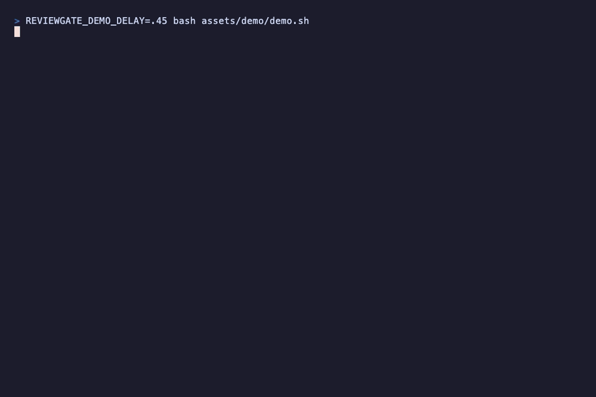

# Reviewgate

**Reviewgate stops your AI coding agent from ending its turn until an independent
panel of LLM reviewers has checked the diff — and blocks it until every real
finding is fixed or rejected-with-reason.** It's the *checker* half of the agent
loop, packaged so the writer can't grade its own homework.

- 🐛 **Catches real bugs before the agent says "done"** — a heterogeneous panel
  (Codex · Gemini · Claude · OpenRouter) reviews the actual diff, in-loop, every turn.
- 🚦 **Never silently passes** — it fails *closed*: no reviewers, a crash, a timeout
  or a quota-out **blocks** the turn instead of waving it through.
- 📋 **Leaves an audit trail** — every finding and every fix/reject decision is
  written to files (`.reviewgate/pending.md`) a human (or CI) can inspect later — no
  chat-stream parsing, no flaky stdout scraping.

Reviewers run the official provider CLIs, so users on Claude Pro/Max, ChatGPT
Plus/Pro and Gemini Advanced pay **$0 per review** within their subscription
quotas (OAuth-first). OpenRouter reviewers use an API key and can target any
hosted model by name.

> [!WARNING]
> **Alpha.** Reviewgate runs provider CLIs on your working-tree diff. Reviewer
> **filesystem isolation ships** (macOS Seatbelt, Linux bubblewrap) but is
> **opt-in** (`sandbox.mode`, default `off`), and **network egress is not
> isolated** on either platform. Prefer your own code / trusted repos. See
> [Security](#security).

<p align="center">
  
</p>

## 60-second quickstart

```bash
npm i -g reviewgate     # your platform's prebuilt binary
cd your-repo
reviewgate init         # bakes the Stop/PostToolUse hooks into .claude/settings.json
reviewgate setup        # interactive wizard — pick reviewers (or skip for defaults)
reviewgate doctor       # verify the reviewer CLIs are reachable
```

Done. Next time Claude Code edits a file in this repo and tries to finish,
Reviewgate reviews the diff and blocks the turn if it finds a real problem.

> **Want the _why_?** How this fits "write loops, not code", the failure modes it
> survives, the security model → [Why](#why-reviewgate-is-the-verification-loop) ·
> [Failure modes](#failure-modes-it-survives) · [Security](#security).

<details><summary><b>Full feature list</b> (<code>0.1.0-alpha</code>)</summary>

Multi-reviewer panel (Codex · Gemini · Claude · OpenRouter) · parallel execution ·
adversarial critic · adaptive triage · tree-sitter symbol graph · research context ·
review cache · quota auto-failover · per-repo learning brain + curator ·
false-positive ledger · stats & weekly reports · interactive `setup` wizard ·
opt-in reviewer filesystem isolation (macOS Seatbelt / Linux bubblewrap). Remaining
caveat: network egress is not isolated. See [Scope & limitations](#scope--limitations).
</details>

---

## How it works

```
┌──────────────────────────── Claude Code (host) ────────────────────────────┐
│  Edit / Write / MultiEdit                                                   │
│        │                                                                    │
│        ▼  PostToolUse hook                                                  │
│  .reviewgate/bin/trigger  ──►  marks .reviewgate/dirty.flag                 │
│                                                                             │
│  …Claude finishes its turn…                                                 │
│        │                                                                    │
│        ▼  Stop hook                                                         │
│  .reviewgate/bin/gate  ──►  reviewgate gate --hook stop                     │
│        │                                                                    │
│        ├─ no changes since last pass ───────────────────────► allow stop   │
│        │                                                                    │
│        ▼  spawn Codex (sandboxed*) on `git diff HEAD`                       │
│  aggregate findings → verdict                                               │
│        │                                                                    │
│        ├─ PASS / SOFT-PASS ─────────────────────────────────► allow stop   │
│        ├─ FAIL ──► write pending.md/json, BLOCK Claude's turn               │
│        │           Claude reads pending.md, fixes or rejects each finding,  │
│        │           appends decisions/<iter>.jsonl, stops again → re-review  │
│        └─ max iterations / stuck / cost cap ──► ESCALATION.md, allow stop   │
└─────────────────────────────────────────────────────────────────────────────┘
```

\* Reviewer **filesystem isolation ships** via OS sandboxing — macOS Seatbelt
(`sandbox-exec`) and Linux bubblewrap (`bwrap`) — enabled with `sandbox.mode:
"strict"` (fails closed if the OS sandbox is unavailable) or `"permissive"` (runs
unisolated with a warning). The default is `"off"`. Network egress is **not**
isolated on either platform. See [Security](#security).

> 📐 For the full control flow, module map and pipeline stages, see
> [`docs/architecture.md`](docs/architecture.md).

---

## Why: Reviewgate is the verification loop

The current meta in agentic coding is **"write loops, not code"** ([Boris
Cherny](https://medium.com/@fahey_james/i-dont-prompt-claude-anymore-i-write-loops-that-prompt-claude-57e48a4f28d7),
[Simon Willison](https://simonwillison.net/2025/Sep/30/designing-agentic-loops/),
[Addy Osmani](https://addyosmani.com/blog/loop-engineering/)). The unit of work
moved from the keystroke → to the prompt → to the **loop**: you stop writing
lines and start designing the system that prompts the agent and lets it iterate
until a goal is met.

Every agentic loop has two halves — a **generator** that produces code and a
**checker** that verifies it and decides when to stop. The loop-engineering
crowd is near-unanimous on the part that actually makes a loop trustworthy:
*split the one who writes from the one who checks*, and give the loop a
**testable termination condition** so it can't grade its own homework or run
forever.

**Reviewgate is that checker, packaged as reusable infrastructure.** It is not a
code-generating orchestrator (that's the host — Claude Code's `Workflow`,
parallel agents, cron). It is the verification loop you drop *into* such a loop
so it can't merge unreviewed work "while you sleep":

| Loop-engineering principle | Reviewgate |
| --- | --- |
| Writer ≠ checker (no self-grading) | A **heterogeneous reviewer panel** (Codex · Gemini · Claude · OpenRouter) — independent models inspect the diff |
| "Are you done?" check each turn | A **`Stop` hook** blocks the turn's end until every finding is fixed or rejected-with-reason |
| Testable termination condition | `decisions/<iter>.jsonl` must address every finding id in `pending.json` before the gate allows the stop |
| Adversarial verification | A demote-only **critic** + severity-weighted veto + cross-reviewer consensus |
| Explicit failure exits (no infinite loop) | `LoopDriver` caps iterations and emits `ESCALATION.md` on max-iter / stuck-signatures / cost-cap / high-reject-rate |
| Feedback as an observable signal | Findings are written to **files** the agent reads with its normal Read tool — no chat-stream scraping |

In a full "write loops, not code" setup, Reviewgate is the `/goal`-style
verifier that runs at the end of each turn.

**And it's measured, not asserted.** On a labelled ground-truth corpus, the panel
caught **every seeded security bug** (recall 8/8), and the demote-only critic
**halved the panel's false-positive rate** on clean code (0.90 → 0.40) at **zero
recall cost** — the empirical answer to "does the suppression stack earn its
complexity?". Numbers + a copy-paste way to reproduce them:
**[`bench/`](bench/README.md)** (`reviewgate bench run` / `bench matrix`).

---

## Failure modes it survives

A code-review gate has exactly one job: **don't let a real bug ship.** The easy
part is reviewing a diff — any wrapper around an LLM does that in an afternoon.
The hard part is **never silently failing _open_**: a gate that quietly says
"green" when it didn't actually check is worse than no gate at all, because you
*trust* it.

Almost everything below was learned the hard way, in production, dogfooding
Reviewgate on its own changes. Each one is a way a naïve gate fails open — and
what this one does instead. The fix is the product.

> **Design rule:** when in doubt, **fail closed** — block, over-review, or
> escalate to a human. Never fail open: pass, hide, or demote. Every guard below
> is a consequence of that rule.

**"No findings" must never mean "PASS."** *Naïve:* every reviewer is
quota-exhausted or times out → the panel returns nothing → "0 findings" →
**PASS**. *Reality:* your code was never reviewed; the gate just waved it through.
*Reviewgate:* zero successful reviews is an **ERROR that blocks**, distinct from a
real clean pass.

**A demote is not harmless.** *Naïve:* an "uncertain" CRITICAL is quietly
downgraded to WARN so the turn can proceed. *Reality:* under the default policy a
WARN-only result *soft-passes* — so a real, possibly-correct CRITICAL **vanishes
with no decision required**. *Reviewgate:* a finding demoted *from* CRITICAL is
flagged and still requires an explicit decision before the turn can end — it can
never silently soft-pass.

**Reviewers hallucinate — including in code they never saw.** *Naïve:* trust the
panel. *Reality:* a lone reviewer emits a 0.97-confidence CRITICAL citing
`file:line` in a file with *fewer lines than that* — a fabrication that, at panel
size 1, hard-FAILs the gate with full authority. *Reviewgate:* a deterministic,
no-LLM fact-check demotes a finding whose cited line provably doesn't exist;
diff-scoping makes findings on *unchanged* code advisory; a demote-only critic and
cross-reviewer consensus down-weight the rest.

**A blocked turn must not become an infinite loop.** *Naïve:* "block until every
finding is resolved." *Reality:* the agent writes its decision file → that write
re-arms the dirty flag → the gate re-blocks → forever. *Reviewgate:* the loop is
bounded — it caps iterations and emits an `ESCALATION.md` (releasing the turn to a
human) on max-iterations, stuck-signatures, cost-cap or a high reject-rate.

**Multi-agent shared checkouts break "review the repo's HEAD."** *Naïve:* review
whatever is in the working tree. *Reality:* in a shared checkout, session A's gate
blocks on session B's parallel work — code A never wrote. And the obvious fix
("attribute *committed* work to a session") is *itself* a fail-open: a file
authored via a shell command and then committed is invisible to every attribution
signal, so an agent could "disown" its own CRITICAL. *Reviewgate:* per-session
**baseline-delta ownership** scopes uncommitted work soundly; committed foreign
work is *never* silently demoted — it routes to an honest, human-surfaced
**escalation**. (That unsound auto-attribution was caught by an adversarial
pre-implementation review *before* a line of it shipped.)

**The bug a green test suite can't see.** *Naïve:* the schema looks right and the
stub tests pass — ship it. *Reality:* one property missing from a strict
JSON-schema's `required` list makes *every real* provider review return HTTP 400;
the stub-based tests never hit the real endpoint, so they stay green. *Reviewgate:*
a structural test replicates the provider's strict-mode rules so the trap can't be
reintroduced — and provider changes are verified against a *real* CLI/API call, not
just stubs.

### How these get found

None of this comes from foresight — it comes from process:

- **It dogfoods itself.** Reviewgate runs its own gate on every change to
  Reviewgate; most of the incidents above were surfaced by the tool reviewing its
  own diff.
- **Adversarial verification, before *and* after.** Plans are reviewed by an
  independent model panel *before* implementation (a pre-implementation gate that
  has killed real fail-opens on paper) and again after — reviewers prompted to
  *refute*, not rubber-stamp.
- **Real calls, not just mocks.** Provider behaviour is verified end-to-end against
  the actual CLIs/APIs, because stubs have hidden whole classes of bug.

If a guard ever looks paranoid, assume it's load-bearing — it's almost certainly a
scar from one of the failures above.

---

## Requirements

- [Bun](https://bun.sh) ≥ 1.0 (Node 20+ works for the compiled binary)
- **At least one reviewer CLI**, installed and logged in:
  - [Codex CLI](https://github.com/openai/codex) ≥ 0.130 (`codex login`) — recommended default
  - [Gemini CLI](https://github.com/google-gemini/gemini-cli) (OAuth)
  - [Claude Code](https://claude.com/claude-code) (OAuth)
  - …or an [OpenRouter](https://openrouter.ai) API key for any hosted model
- macOS or Linux (Windows: use WSL2)
- git

You don't need all of them — one is enough to start. Check exactly which
reviewers are ready on your machine at any time:

```bash
reviewgate doctor
```

---

## Install

### Option A — one-liner install (fastest)

Detects your platform, downloads the matching prebuilt binary from
[Releases](https://github.com/Codevena/reviewgate/releases), **verifies its
SHA-256**, and symlinks it onto your `PATH` (into `~/.local/bin`). No sudo, no
build step, no Bun required:

```bash
curl -sSL https://raw.githubusercontent.com/Codevena/reviewgate/master/install.sh | sh
reviewgate --version
```

Pin a version with `REVIEWGATE_VERSION=v0.1.0-alpha.3`, or change where it lands
with `REVIEWGATE_INSTALL_DIR` / `REVIEWGATE_BIN_DIR`. macOS + Linux (arm64/x64).

<details><summary>…or download the tarball manually</summary>

Grab the asset for your os-arch from the Releases page and keep the extracted
folder intact — the binary loads its sibling `grammars/` (tree-sitter `.wasm`) at
runtime. Each release ships a `SHA256SUMS.txt` to verify against:

```bash
tar xzf reviewgate-v0.1.0-alpha.3-darwin-arm64.tar.gz
ln -sf "$PWD/reviewgate-v0.1.0-alpha.3-darwin-arm64/reviewgate" /usr/local/bin/reviewgate
reviewgate --version
```

</details>

### Option B — build from source (contributors / latest `master`)

```bash
git clone https://github.com/Codevena/reviewgate.git
cd reviewgate
bun install
bun run build          # produces ./dist/reviewgate (+ sibling grammars/)
```

Then, in the repo you want reviewed:

```bash
reviewgate init        # installs hooks into .claude/settings.json,
                       # copies .reviewgate/bin/{trigger,gate,reset},
                       # appends .gitignore, writes a starter reviewgate.config.ts
```

`init` is idempotent and merges into existing `.claude/settings.json` without
clobbering your other hooks.

Prefer to be walked through provider/model/quota choices? Run the interactive
wizard instead of hand-writing the config:

```bash
reviewgate setup       # interactive configuration wizard
```

### Option C — npm (`npm i -g reviewgate`)

```bash
npm i -g reviewgate     # installs only your platform's prebuilt binary
reviewgate init         # arm the gate in the current repo
reviewgate doctor       # health-check
```

A global install is recommended for the persistent Stop gate, because `reviewgate init`
bakes the binary's absolute path into the hook. `npx reviewgate init` works for a quick
try, but the binary lives in an ephemeral npx cache that may be garbage-collected — `init`
warns when it detects this. Supported: macOS and Linux (glibc) on arm64/x64; on other
platforms use Option A or B.

---

## First run — guided walkthrough

Zero to your first blocked review in ~5 minutes.

1. **Arm the repo.** `reviewgate init` in your project (installs the hooks +
   writes a starter `reviewgate.config.ts`).
2. **Get one reviewer working.** You need exactly one to start. Either run the
   wizard — `reviewgate setup` — or do it by hand:
   - **Lowest friction (no CLI):** set `OPENROUTER_API_KEY` and add an
     `openrouter` reviewer to `phases.review.reviewers` (paid per call).
   - **$0 within your subscription:** install + log in to one OAuth CLI — `codex
     login`, Claude Code, or the Gemini CLI — they're already in the starter config.

   Then confirm what's actually ready: **`reviewgate doctor`** tells you exactly
   which reviewers it can reach and what to fix.
3. **See it work (60-second smoke test) — *before* you trust it in a loop.** Make
   a deliberately broken change and run the gate by hand:

   ```bash
   echo 'export const refund = (amt, by) => amt / by;  // div-by-zero, no guard' >> smoke.ts
   git add smoke.ts
   reviewgate gate            # reviews `git diff HEAD`
   cat .reviewgate/pending.md # the findings the panel raised
   git rm -f smoke.ts
   ```
4. **Use Claude Code as normal.** After it edits files and tries to finish a turn,
   the `Stop` hook runs the review. If a reviewer raises a blocking finding, Claude
   is told to read `.reviewgate/pending.md` and address each one — it **cannot end
   the turn** until every finding is fixed or rejected-with-reason.
5. **You review the final diff and commit manually.** Reviewgate never commits or
   edits code itself; it only reports.

Useful commands outside the loop:

```bash
reviewgate doctor                    # which reviewers are ready + what to fix
reviewgate setup                     # interactive configuration wizard
reviewgate gate                      # review current `git diff HEAD` on demand
reviewgate reset                     # re-arm the gate (clear this session's review state)
reviewgate audit verify --file <jsonl>   # verify an audit-log hash chain
```

---

## Configuration — `reviewgate.config.ts`

`reviewgate.config.ts` is a **plain default-export object** (no import needed).
Reviewgate deep-merges it over the defaults and validates it. Do **not** write
`import { defineConfig } from "reviewgate"` — that package isn't installed in your
project, so the import would fail and Reviewgate would silently use defaults.

Minimal single-reviewer setup (Codex only, OAuth, $0):

```ts
export default {
  providers: {
    codex: { enabled: true, auth: "oauth", model: "gpt-5.5", timeoutMs: 300_000 },
  },
  loop: {
    maxIterations: 3,        // escalate to the human after N failed review rounds
    costCapUsd: 1.5,         // only enforced in apikey/openrouter mode (OAuth = $0)
    softPassPolicy: "allow", // allow | block | ask-once for WARN-only verdicts
  },
  sandbox: {
    mode: "off",
  },
};
```

Multi-reviewer panel with an OpenRouter critic:

```ts
export default {
  providers: {
    codex: { enabled: true, auth: "oauth", model: "gpt-5.5", timeoutMs: 300_000 },
    gemini: { enabled: true, auth: "oauth", model: "gemini-3.5-flash", timeoutMs: 300_000 },
    "claude-code": { enabled: true, auth: "oauth", model: "claude-sonnet-4-6", timeoutMs: 300_000 },
    openrouter: {
      enabled: true,
      auth: "openrouter",
      model: "deepseek/deepseek-v4-pro",   // ← any OpenRouter model slug (see below)
      apiKeyEnv: "OPENROUTER_API_KEY",
      costPerMTokensUsd: 0.075,            // optional; fed into loop costCapUsd tracking
      timeoutMs: 120_000,
    },
  },
  phases: {
    review: {
      reviewers: [
        { provider: "codex",       persona: "security" },
        { provider: "gemini",      persona: "security" },
        { provider: "claude-code", persona: "adversarial" },
        { provider: "openrouter",  persona: "security" },
      ],
    },
    critic: { provider: "openrouter", persona: "critic" },
  },
  loop: {
    maxIterations: 3,
    costCapUsd: 2.0,
    softPassPolicy: "allow",
  },
};
```

Anything you omit falls back to the defaults. The config is zod-validated.

### Deterministic checker tier (`phases.checks`)

Before the LLM panel runs, Reviewgate can execute a set of **deterministic
commands** (typecheck, build, test suite, linter) that are fast, free, and
perfectly reproducible. If any command exits non-zero the gate **fails closed**
immediately — without spending a single token on reviewer inference — and
surfaces the exact output as a `CRITICAL` finding. Commands run in order,
fail-fast (the first failure stops the rest).

```ts
// reviewgate.config.ts — run tsc + tests before the LLM panel; a failure blocks
// the turn (with the output) and skips the panel. Order cheap → expensive.
phases: {
  checks: {
    commands: [
      { name: "typecheck", run: "bun run typecheck", timeoutMs: 120_000 },
      { name: "test",      run: "bun test",          timeoutMs: 300_000 },
    ],
  },
}
```

Key properties:

- Commands run **unsandboxed** — they are your own trusted config (same trust
  level as `reviewgate.config.ts` itself), not untrusted reviewer subprocesses.
- A check failure is **not rejectable** by the agent; it must be fixed (or the
  check removed from the config) before the panel runs. This prevents the
  agent from shipping code that doesn't compile or breaks tests.
- Each command has an optional `timeoutMs` (default 300 s). A timeout is also
  treated as a failure (fail-closed, never a silent skip).
- Combine with `sandbox.mode` to isolate only the LLM reviewers — the checks
  tier always runs unsandboxed regardless of the sandbox setting.

### Completion signal

A passing review used to be silent (the Stop hook just exits 0). Now the gate
always writes a one-line summary to **stderr** on completion — e.g.
`Reviewgate: DONE — Reviewgate PASS on iteration 1.` or `Reviewgate: BLOCK — …` —
so "green" is distinguishable from "the gate didn't run". Set `notify.desktop: true`
to also fire a macOS/Linux desktop notification when a review finishes:

```ts
export default {
  // ...providers, phases...
  notify: { desktop: true },   // osascript (macOS) / notify-send (Linux)
};
```

Note: by hook architecture, an AI agent can only be *interrupted* on a blocking
(FAIL) verdict — on PASS its turn simply ends. The stderr line and desktop
notification are the human-facing signal; an agent confirms a pass by reading
`.reviewgate/state.json` / `pending.md`.

If you want the **agent** to be told about a pass too, set
`loop: { acknowledgePass: true }`. Then a passing review blocks ONCE with a
`✅ Reviewgate PASS …` message so the agent can confirm the result to you, and
ends cleanly on the next stop (one extra turn per pass; default off).

### Choosing the OpenRouter model

The OpenRouter reviewer can target **any model OpenRouter hosts** — just set the
`model` field to its slug. Examples that work today:

```
deepseek/deepseek-v4-pro        deepseek/deepseek-v4-flash:free
google/gemini-2.0-flash-001     openai/gpt-4o-mini
anthropic/claude-sonnet-4.5     meta-llama/llama-3.3-70b-instruct
```

Browse and copy exact slugs from <https://openrouter.ai/models>. An invalid slug
returns a 404 (`ModelNotFoundError`) and the reviewer reports `status: error`
(fail-closed — never a silent pass). Set your key once in the shell:

```bash
export OPENROUTER_API_KEY=sk-or-...   # e.g. in ~/.zshrc
```

Reviewgate sends a strict JSON schema via OpenRouter's `response_format`; models
that ignore it are still recovered by the tolerant parser.

---

## Verdicts

| Verdict       | Meaning                                              | Effect            |
|---------------|------------------------------------------------------|-------------------|
| **PASS**      | No findings, or INFO only                            | allow stop        |
| **SOFT-PASS** | Only WARN findings, singleton/minority, no CRITICAL  | allow stop (default policy) |
| **FAIL**      | A CRITICAL (security/correctness), or majority WARN  | **block** until addressed |
| **ESCALATE**  | Max iterations, stuck findings, or cost cap hit      | writes `ESCALATION.md`, allow stop |
| **ERROR**     | Reviewer could not run (crash/timeout/sandbox)       | **block** (fail closed), eventually escalates |

Reviewgate **fails closed**: a reviewer that crashes or times out is never
treated as a pass.

---

## Adaptive pipeline

Four stages run before the reviewer panel, making the gate faster and more
precise without changing any external protocols:

### Triage

Before spawning any reviewer, Reviewgate classifies the diff:

- **Doc-only diffs** (changes confined to Markdown, comments, or other
  non-executable files) are **skipped at $0** — they get an automatic PASS
  verdict without touching the reviewer panel.
- **Sensitive-path diffs** (auth, crypto, payment, admin) receive an expanded
  review budget (more iterations, higher cost cap).

### Research context

For every non-trivial diff Reviewgate builds a `research.md` context file and
injects it into each reviewer's prompt. The context includes:

- A summary of which files changed and why.
- **Symbol graph** callers/callees (see below).
- Any relevant entries from the per-repo learning brain (when enabled).

Every reviewer reads this context, so findings reference stable symbol names
rather than raw line numbers.

### Tree-sitter symbol graph

Reviewgate uses `web-tree-sitter` + grammar WASM files to extract the call
graph around the changed symbols. Supported languages: TypeScript, TSX,
JavaScript, JSX, Python.

The symbol graph needs [ripgrep](https://github.com/BurntSushi/ripgrep) (`rg`)
to find callers efficiently. If `rg` is absent, the symbol graph degrades
gracefully (callers list is empty; reviews still run). If no grammar WASM can
be found the symbol graph is disabled entirely but reviews are unaffected.

Grammar WASM files are bundled into `dist/grammars/` by `bun run build` so the
compiled binary works without `node_modules`. Run `reviewgate doctor` to confirm
both `rg` and the grammars are available.

### Review cache

When the diff is byte-for-byte identical to a previous run (same content hash),
Reviewgate returns the cached verdict without spawning any reviewer. This makes
repeated stop-hooks instantaneous after a trivially clean re-run.

---

## Security

- **Author ≠ reviewer.** The host Claude session never reviews its own work; the
  anti-sycophancy rule downgrades any Claude reviewer to a smaller tier.
- **Diff sanitisation.** Diffs are run through a 6-layer pipeline (Unicode NFKC
  normalise → injection-marker neutralise → fenced wrap → high-entropy secret
  redaction → persona reaffirmation) before reaching the reviewer, to blunt
  prompt-injection planted in code.
- **Tamper-evident audit log.** Every run appends a sha256 hash-chained JSONL
  event log; `reviewgate audit verify` detects any modification.
- **Sandbox (filesystem isolation ships; opt-in).** With `sandbox.mode: "strict"`
  or `"permissive"`, reviewer subprocesses run under OS filesystem isolation —
  macOS Seatbelt (`sandbox-exec`) or Linux bubblewrap (`bwrap`): the reviewer reads
  its working dir / tmp / own creds but **not** your secrets (`~/.ssh`, `~/.aws`,
  `.env`, …). `"strict"` fails closed if the OS sandbox is unavailable; the default
  is `"off"`. **Caveats:** network egress is **not** isolated on either platform
  (API reviewers need it), and on Linux glob secret-denies (`*.pem`, `.env*`) aren't
  enforced — prefer trusted repos until you've reviewed the threat model.

See [`SECURITY.md`](SECURITY.md) for the full threat model and how to report a
vulnerability.

---

## What gets written to `.reviewgate/`

| Path                         | Committed? | Purpose                                  |
|------------------------------|-----------|-------------------------------------------|
| `bin/{trigger,gate,reset}`   | yes        | tiny hook shims that call the binary      |
| `personas/security.md`       | yes        | the reviewer's persona prompt             |
| `pending.md` / `pending.json`| no         | current iteration's findings (human + machine) |
| `decisions/<iter>.jsonl`     | no         | Claude's accept/reject ledger             |
| `state.json`                 | no         | loop FSM state                            |
| `audit/…`                    | no         | hash-chained event log                    |
| `ESCALATION.md`              | no         | written when a run escalates to the human |

---

## For AI agents

If you are an AI coding agent operating in a Reviewgate-enabled repo, read
[`docs/AGENTS.md`](docs/AGENTS.md) — it specifies exactly how to respond when
Reviewgate blocks your turn (read `pending.md`, fix or reject each finding, write
`decisions/<iter>.jsonl`).

---

## Scope & limitations

**Reviewing**

- Multi-reviewer panel — Codex + Gemini + Claude + OpenRouter (any model by slug),
  run in parallel, with an adversarial critic phase and `confirmed_by` cross-reviewer
  consensus tracking.
- Severity-weighted veto verdict · `pending.md`/`pending.json` + decisions protocol ·
  single loop with escalation (max-iterations / stuck-signatures / cost-cap).
- Quota auto-failover — if a reviewer hits its usage cap, the gate fails over to a
  configured fallback provider, remembers when the limit resets, and resumes the
  primary automatically (no config edit).

**Speed & precision**

- Adaptive triage — doc-only diffs skip review at $0; sensitive paths (auth, crypto,
  payment) get an expanded budget.
- `research.md` context injected into every reviewer prompt — a tree-sitter symbol
  graph (TS/JS/TSX/Python; ripgrep used for callers if present, degrades gracefully)
  and, when enabled, Context7 library docs.
- Review cache — an identical diff returns a cached verdict with no reviewer spawn.

**Learning**

- Per-repo learning brain & Curator (see [Brain & Curator](#brain--curator)) — committed
  memory; `reviewgate brain list|show|revoke`.
- False-positive ledger — FPs you reject are demoted on future runs;
  `reviewgate fp list|show|pin|unpin|audit`.

**Tooling**

- Commands: `init` · `gate` · `doctor` · `audit verify` · `stats` · `report` ·
  `review-plan <file>` · `setup` (interactive wizard) · `brain` · `fp`.
- Cost model: OAuth ($0) for Codex/Gemini/Claude; OpenRouter via API key, tracked
  against `costCapUsd`.
- Hash-chained audit log · cassette record/replay for deterministic provider testing.

**Caveats:** reviewer filesystem isolation ships (macOS Seatbelt / Linux bubblewrap)
but is opt-in (`sandbox.mode`, default `off`); **network egress is not isolated** on
either platform, and Linux does not enforce glob secret-denies. See [Security](#security).

---

## Brain & Curator

The brain is a **committed per-repo memory** (`reviewgate.brain.json`,
`brain.md`, `sources.jsonl`, `archive.md` under `.reviewgate/brain/`). Every
reviewer reads the brain entries most relevant to the current diff and may
propose new facts. The **Curator** is a non-blocking background validator that
applies 7 acceptance rules (uniqueness, source authority, cross-provider
quorum, embedding dedup against existing entries, etc.) before anything enters
the brain; proposals that fail are discarded or archived, never silently
committed.

**Committed vs. gitignored:**

| Path | Committed? |
|---|---|
| `.reviewgate/brain/brain.json` | yes |
| `.reviewgate/brain/brain.md` | yes |
| `.reviewgate/brain/sources.jsonl` | yes |
| `.reviewgate/brain/archive.md` | yes |
| `.reviewgate/brain/proposals/` | no (gitignored) |
| `.reviewgate/brain/snapshots/` | no (gitignored) |

**Enable in `reviewgate.config.ts`:**

```ts
export default {
  // ...providers, phases...
  phases: {
    brain: {
      enabled: true,
      embeddings: {
        model: "baai/bge-base-en-v1.5",   // default; any sentence-transformers slug works
      },
      // optional: which provider runs Curator validation
      curator: { provider: "codex" },
      // optional: domains the brain may fetch sources from
      egressAllowlist: ["github.com", "docs.example.com"],
    },
  },
};
```

**CLI:**

```bash
reviewgate brain list          # list all committed brain entries
reviewgate brain show <id>     # show a single entry with metadata
reviewgate brain revoke <id>   # remove an entry (writes archive.md, re-commits)
```

---

## Development

```bash
bun test            # unit + integration (fake Codex stub)
bun run typecheck   # tsc --noEmit
bun run lint        # biome
bun run build       # compile single binary

REVIEWGATE_E2E=1 bun test tests/e2e   # real Codex end-to-end (uses your quota)
```

The design spec lives in `docs/superpowers/specs/`, the implementation plans in
`docs/superpowers/plans/`, and spike findings in `docs/superpowers/spikes/`.

See [`CONTRIBUTING.md`](CONTRIBUTING.md) before opening a PR.

---

## Contributing

Bug reports, feedback, and small focused PRs are welcome — see
[`CONTRIBUTING.md`](CONTRIBUTING.md). For security issues, follow
[`SECURITY.md`](SECURITY.md) (do not file them publicly).

## License

[MIT](LICENSE) © Markus Wiesecke
